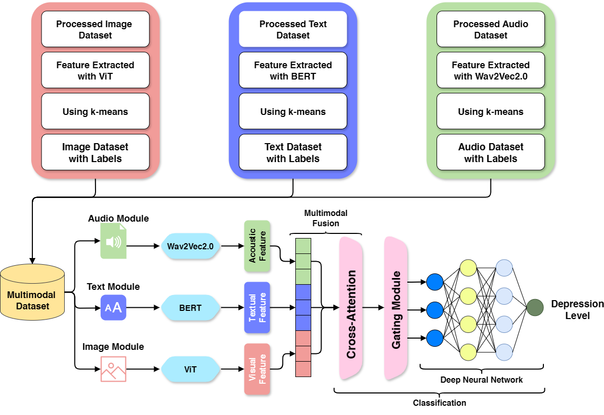
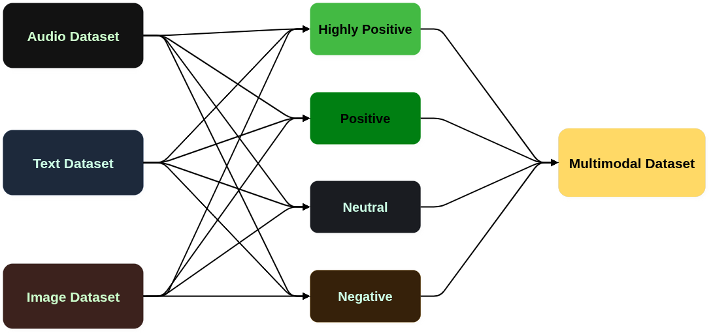
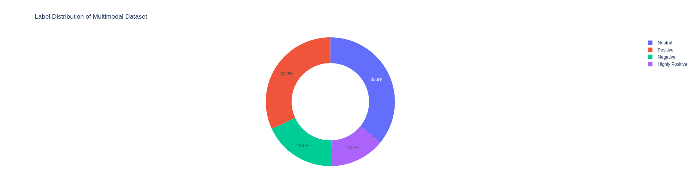

# Multimodal-Depression-Detection

## Abstract
Depression is a growing mental health problem and accurate detection is currently a major challenge. Conventional methods is less effective in handling diverse and heterogeneous data environments. In this paper, a robust multimodal transformer-based architecture named Audio-Image-Text Fusion Triple-Branch Network (AITF-TBN) is proposed for depression detection categorized into four depression labels: highly positive, positive, neutral and negative. A categorized multimodal dataset for depression detection (CMDDD) is also developed that contains 55,713 audio, image and text data, where each sample is annotated with those four depression labels. The proposed architecture uses Wav2Vec2.0, ViT and BERT to extract acoustic, visual and textual features, respectively. These features are fused by a multihead cross-attention layer and a gating module. The architecture uses linear transformations, transformer-based encoders, attention-based pooling and modality-specific gating mechanisms to create a fused representation. Modality dropout is used for robustness against missing or noisy inputs, enhancing classification performance and representation learning. The proposed system achieves an accuracy of 86% in depression detection, outperforming existing multimodal transformer-based architectures. The proposed AITF-TBN model, along with the dataset, demonstrates the performance of multimodal fusion for depression detection and offers a practical approach for mental health analysis. > The source code is accessible at https://github.com/Rafi3690/Multimodal-Depression-Detection.

---

## Architecture
<p align="center">
  
</p>

<!--
```python
Version : 0.0.1
Author  : M.A. Rafi
Email   : 190125.cse@student.just.edu.bd
```
-->

**LOCAL ENVIRONMENT**

```text
OS: Windows 11
Memory: 64 GB
Processor: AMD Ryzen 9 3900X
CPU: 12 Cores / 24 Threads
Graphics: NVIDIA GeForce RTX 3090
GPU Memory: 24 GB
```


### Prepare Datasets
We developed the Categorized Multimodal Dataset for Depression Detection (CMDDD) by integrating text, image, and audio data from multiple public datasets. The final CMDDD contains **55,713 multimodal samples** categorized as **Highly Positive, Positive, Negative, and Neutral**. Text, image, and audio features were extracted using **BERT, ViT, and Wav2Vec2.0**, respectively. Unlabeled modality-specific data were categorized using **k-means clustering**, with distance-based refinement used to derive the Highly Positive category. The resulting modality-specific samples were then aligned by emotional category to construct the final multimodal dataset.
<p align="center">
  
</p>

<p align="center">
  
</p>

### Execution (Depression Detection)

Activate your conda environment:

```bash
conda activate your_env
```
